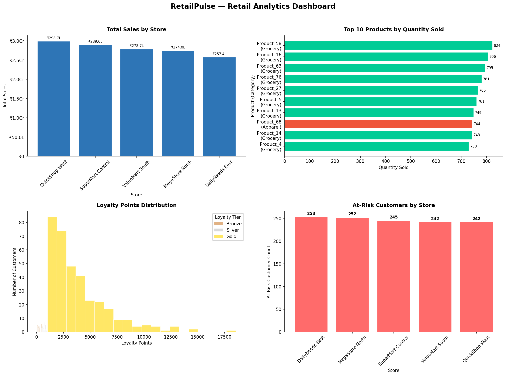

# RetailPulse — Retail Analytics & Loyalty Engine

A complete data pipeline for retail loyalty analytics. Raw CSV files go in, validated clean data comes out, and we generate business insights about customer loyalty, RFM segmentation, and predictive analytics along the way.

---

## What This Project Does

RetailPulse transforms messy retail data into actionable business intelligence:

- **Ingests** raw sales data from CSV files
- **Validates** and cleans data with detailed error tracking
- **Calculates** customer loyalty points based on business rules
- **Segments** customers using RFM (Recency, Frequency, Monetary) analysis
- **Predicts** customer spend, inventory restocking needs, and promotion sensitivity
- **Visualizes** insights through interactive and static dashboards

**No external databases or ML libraries required. 100% logic-based analytics using SQLite.**

---

## The Problem We're Solving

Retail stores collect lots of data — sales transactions, customer info, product details, loyalty programs. But this data is:

- Spread across different CSV files
- Full of errors and inconsistencies (missing values, bad formats, special characters)
- Hard to analyze in its raw form
- Growing every day

Store managers need a system that can:

- Clean and validate data automatically
- Track what's wrong with bad data (not just delete it)
- Calculate loyalty points and customer segments
- Generate predictive insights for inventory and marketing
- Show everything in easy-to-understand dashboards

---

## How We Built It

### The Pipeline (5 Scripts)

We use a sequential pipeline where each script has one clear job:

| Script               | Layer         | Purpose                                                   |
| -------------------- | ------------- | --------------------------------------------------------- |
| `01_setup_db.py`     | Schema        | Creates all database tables (core + rejected + analytics) |
| `02_etl_pipeline.py` | ETL           | Validates, cleans, and loads data; rejects bad records    |
| `03_loyalty_rfm.py`  | Analytics     | Calculates loyalty points and RFM customer segments       |
| `04_predictive.py`   | Predictions   | Forecasts spend, restock flags, promotion sensitivity     |
| `05_dashboard.py`    | Visualization | Generates charts and dashboards                           |

### Data Flow

```
CSV Files → ETL Validation → Clean Tables → Analytics → Predictions → Dashboard
                ↓
         Rejected Tables
         (with reasons)
```

### What Makes This Different

**Smart Data Quality Handling**

Most pipelines either accept everything (garbage in, garbage out) or reject everything (one bad record breaks the whole job). We do it smarter:

- Bad records go to `*_rejected` tables with specific error reasons
- You can see exactly what's wrong with each record
- Clean data keeps flowing
- You can fix and reprocess rejected records later

**Real Analytics, Not Just Counts**

The analytics layer calculates meaningful business metrics:

- **Loyalty Points Engine**: Automatic points calculation based on configurable rules
- **RFM Segmentation**: Identifies high-value and at-risk customers
- **Spend Forecasting**: Predicts next month spend using 3-month moving averages
- **Promotion Sensitivity**: Classifies customers as HIGH/MEDIUM/LOW responders
- **Restock Predictions**: Flags products likely to run out of stock

---

## Tech Stack

| Component       | Technology                              |
| --------------- | --------------------------------------- |
| Language        | Python 3.8+                             |
| Database        | SQLite3 (zero config)                   |
| Data Processing | pandas                                  |
| Visualization   | matplotlib, Streamlit, Plotly           |
| Testing         | pytest (96 unit tests)                  |
| Error Handling  | Custom exception hierarchy with logging |

---

## Project Structure

```
RetailPulse/
├── data/
│   ├── raw/                   # Source CSV files
│   ├── cleaned/               # Validated records (exported)
│   └── rejected/              # Bad records with reasons
│
├── db/
│   └── retail.db              # SQLite database (auto-created)
│
├── src/
│   ├── 01_setup_db.py         # Database schema creation
│   ├── 02_etl_pipeline.py     # ETL: validate, clean, load
│   ├── 03_loyalty_rfm.py      # Loyalty points + RFM segmentation
│   ├── 04_predictive.py       # Predictive analytics
│   ├── 05_dashboard.py        # Static matplotlib dashboard
│   ├── 05_dashboard_streamlit.py  # Interactive web dashboard
│   ├── generate_er_diagram.py # ER diagram generator
│   └── utils/
│       └── error_handler.py   # Centralized error handling
│
├── tests/
│   ├── test_setup_db.py       # Database tests (14 tests)
│   ├── test_etl_pipeline.py   # ETL tests (27 tests)
│   ├── test_loyalty_rfm.py    # Loyalty/RFM tests (22 tests)
│   └── test_predictive.py     # Predictive tests (33 tests)
│
├── output/
│   ├── dashboard.png          # Combined 4-chart dashboard
│   └── chart*.png             # Individual chart images
│
├── logs/
│   └── retailpulse_*.log      # Daily rotating log files
│
├── diagrams/
│   └── er_diagram.png         # Database ER diagram
│
└── README.md
```

---

## The Data We Work With

### Master Data (configuration, rarely changes)

| File                    | Records | Description                     |
| ----------------------- | ------- | ------------------------------- |
| `stores.csv`            | 5       | Store locations and regions     |
| `products.csv`          | 49      | Product catalog with pricing    |
| `loyalty_rules.csv`     | 5       | Point calculation rules by tier |
| `promotion_details.csv` | 10      | Promotional campaigns           |

### Transactional Data (grows daily)

| File                         | Records | Description                      |
| ---------------------------- | ------- | -------------------------------- |
| `customer_details.csv`       | 199     | Customer profiles                |
| `store_sales_header.csv`     | ~2000   | Transaction headers              |
| `store_sales_line_items.csv` | ~5000   | Individual items per transaction |

---

## Setup Instructions

### Prerequisites

- Python 3.8 or higher
- pip (Python package manager)

### Install Dependencies

```bash
pip install pandas matplotlib streamlit plotly pytest
```

### Prepare Data

Ensure CSV files are in `data/raw/`:

- `stores.csv`, `products.csv`, `customer_details.csv`
- `promotion_details.csv`, `loyalty_rules.csv`
- `store_sales_header.csv`, `store_sales_line_items.csv`

---

## How to Run

### Full Pipeline (First Time Setup)

Run all scripts in sequence:

```bash
# Step 1: Create database tables
python src/01_setup_db.py

# Step 2: Run ETL pipeline
python src/02_etl_pipeline.py

# Step 3: Calculate loyalty points and RFM segments
python src/03_loyalty_rfm.py

# Step 4: Run predictive analytics
python src/04_predictive.py

# Step 5: Generate dashboard
python src/05_dashboard.py
```

**Total time: ~30 seconds**

### Interactive Dashboard

Launch the Streamlit web dashboard:

```bash
streamlit run src/05_dashboard_streamlit.py
```

Open browser to `http://localhost:8501` to see:

- Sales trends and store performance
- Customer loyalty distribution
- At-risk customer alerts
- Top products analysis

### Run Unit Tests

Verify everything works correctly:

```bash
# Run all 96 tests
python -m pytest tests/ -v

# Run specific test module
python -m pytest tests/test_etl_pipeline.py -v

# Run with coverage report
python -m pytest tests/ --cov=src
```

---

## Data Quality Validation

The ETL pipeline enforces 5 types of validation:

### 1. Required Fields Check

Mandatory columns cannot be empty:

- `store_id`, `product_id`, `customer_id`, `transaction_id`
- `store_name`, `product_name`, `first_name`

### 2. Data Type Validation

- Numbers must be numeric (prices, quantities, amounts)
- Dates must be valid date formats
- IDs are normalized (float → string conversion)

### 3. Business Rules

- Prices and quantities must be non-negative
- Stock levels must be valid integers
- Percentages must be between 0-100

### 4. Character Stripping

Automatically removes special characters from amounts:

- Currency symbols: `$`, `₹`, `£`, `€`
- Formatting: `,`, `%`

### 5. Rejection Tracking

Bad records aren't deleted — they're moved to `*_rejected` tables with specific error messages:

```sql
-- Example: See why records were rejected
SELECT * FROM products_rejected;
-- Shows: product_id, all columns, reject_reason
```

---

## Error Handling

### Custom Exception Hierarchy

```
RetailPulseError (base)
├── DatabaseError      # Connection, query, table issues
├── FileError          # Missing files, permission errors
├── ETLError           # Validation, transformation failures
├── AnalyticsError     # Calculation, prediction errors
├── DataValidationError # Invalid data format/values
└── ConfigurationError  # Missing config, invalid settings
```

### Features

| Feature              | Description                                             |
| -------------------- | ------------------------------------------------------- |
| **Logging**          | Daily rotating logs in `logs/retailpulse_YYYYMMDD.log`  |
| **Decorators**       | `@handle_exceptions` for consistent error handling      |
| **Retry Logic**      | `@retry_on_error` for transient failures                |
| **Validation Utils** | `validate_file_exists()`, `validate_directory_exists()` |
| **Exit Codes**       | All scripts return 0 (success) or 1 (error)             |

### Example: Graceful Error Recovery

```python
# Individual row errors don't crash the pipeline
for row in csv_data:
    try:
        validate_and_insert(row)
    except DataValidationError as e:
        insert_to_rejected_table(row, reason=str(e))
        continue  # Keep processing other rows
```

---

## Unit Testing

**96 tests** covering all major functionality:

### Test Coverage by Module

| Module                 | Tests | Coverage                                         |
| ---------------------- | ----- | ------------------------------------------------ |
| `test_setup_db.py`     | 14    | Table creation, constraints, idempotency         |
| `test_etl_pipeline.py` | 27    | Validation, type casting, CSV ingestion          |
| `test_loyalty_rfm.py`  | 22    | Points calculation, tier assignment, RFM logic   |
| `test_predictive.py`   | 33    | Spend forecast, restock flags, promo sensitivity |

### Key Test Categories

**Database Tests**

- Tables created correctly with proper schemas
- Primary keys and foreign key relationships
- Default values applied
- Idempotent creation (can run multiple times)

**ETL Tests**

- Special character stripping (`$100` → `100`)
- Null value handling in mandatory columns
- Negative value detection
- Incremental load without duplicates
- Data type casting (dates, floats)

**Analytics Tests**

- Loyalty tier boundaries (Bronze/Silver/Gold)
- RFM recency calculation
- At-risk customer flagging (>30 days)
- High spender identification (top 20%)

**Predictive Tests**

- 3-month moving average calculation
- Restock threshold logic
- Promotion sensitivity classification
- Edge cases (zero history, large values, decimals)

### Running Tests

```bash
# All tests with verbose output
python -m pytest tests/ -v

# Stop on first failure
python -m pytest tests/ -x

# Run tests matching a pattern
python -m pytest tests/ -k "loyalty"

# Generate HTML report
python -m pytest tests/ --html=report.html
```

---

## Database Schema

### Core Tables (7)

| Table                    | Primary Key    | Description                        |
| ------------------------ | -------------- | ---------------------------------- |
| `stores`                 | store_id       | Store locations and regions        |
| `products`               | product_id     | Product catalog with pricing       |
| `customer_details`       | customer_id    | Customer profiles and loyalty info |
| `store_sales_header`     | transaction_id | Sales transaction headers          |
| `store_sales_line_items` | line_item_id   | Individual items per transaction   |
| `promotion_details`      | promotion_id   | Promotional campaigns              |
| `loyalty_rules`          | rule_id        | Point calculation rules            |

### Rejected Tables (7)

Mirror tables with additional `reject_reason` column:

- `stores_rejected`, `products_rejected`, `customer_details_rejected`
- `store_sales_header_rejected`, `store_sales_line_items_rejected`
- `promotion_details_rejected`, `loyalty_rules_rejected`

### Analytics Tables (2)

| Table                  | Description                                  |
| ---------------------- | -------------------------------------------- |
| `rfm_summary`          | Customer recency, frequency, monetary scores |
| `customer_predictions` | Predicted next month spend                   |

---

## Customer Segments

| Segment      | Code | Criteria                  | Business Action                      |
| ------------ | ---- | ------------------------- | ------------------------------------ |
| High Spender | HS   | Top 20% by monetary value | VIP treatment, exclusive offers      |
| At Risk      | AR   | No purchase in 30+ days   | Retention campaigns, win-back offers |

_Note: HS takes priority if customer qualifies for both._

---

## Loyalty Tiers

| Tier   | Points Required | Benefits                          |
| ------ | --------------- | --------------------------------- |
| Gold   | ≥ 1000          | Premium rewards, priority support |
| Silver | ≥ 500           | Standard rewards                  |
| Bronze | < 500           | Basic rewards                     |

---

## Output Files

After running the full pipeline:

| Location                 | Contents                      |
| ------------------------ | ----------------------------- |
| `db/retail.db`           | SQLite database with all data |
| `data/cleaned/*.csv`     | Validated clean records       |
| `data/rejected/*.csv`    | Rejected records with reasons |
| `output/dashboard.png`   | Combined 4-chart dashboard    |
| `output/chart*.png`      | Individual chart images       |
| `logs/retailpulse_*.log` | Execution logs                |

---

## Dashboard Preview

The dashboard includes 4 charts:

1. **Total Sales by Store** — Vertical bar chart showing revenue per store
2. **Top 10 Products** — Horizontal bar chart by quantity sold
3. **Loyalty Distribution** — Histogram of points by tier (Bronze/Silver/Gold)
4. **At-Risk Customers** — Bar chart showing at-risk count per store



---

## ER Diagram


---

## Common Issues and Solutions

| Issue                     | Solution                                                               |
| ------------------------- | ---------------------------------------------------------------------- |
| `Database not found`      | Run `01_setup_db.py` first                                             |
| `No data in tables`       | Run `02_etl_pipeline.py` to load CSVs                                  |
| `High rejection rate`     | Check `*_rejected` tables for specific errors                          |
| `Dashboard shows no data` | Ensure all pipeline scripts ran successfully                           |
| `Import errors`           | Install dependencies: `pip install pandas matplotlib streamlit plotly` |
| `Tests failing`           | Run from project root: `python -m pytest tests/ -v`                    |

---

## Design Decisions

### Why SQLite instead of PostgreSQL?

- Zero configuration — no server setup required
- Single file database — easy to share and backup
- Perfect for hackathon scope and demonstration
- Can easily migrate to PostgreSQL for production

### Why reject tables instead of just dropping bad records?

- Audit trail — see exactly what went wrong
- No data loss — can fix and reprocess later
- Debugging — specific reject reasons help identify data quality issues
- Business keeps running while you improve data quality

### Why 5 separate scripts instead of one monolith?

- Each script has one clear responsibility
- Easy to debug — run just the failing script
- Rerunnable — fix an issue and rerun from that point
- Clear data lineage and pipeline stages

### Why unit tests?

- Confidence that logic is correct
- Catch regressions early
- Documentation of expected behavior
- Enables safe refactoring

---

## Future Improvements

If we had more time:

- **Incremental loading**: Only process new transactions by date range
- **Real-time dashboard**: Auto-refresh with live data
- **API endpoints**: REST API for external system integration
- **Email alerts**: Notify when data quality drops
- **ML predictions**: Customer churn prediction, lifetime value estimation
- **Data versioning**: Ability to rollback to previous states

---

## Author

RetailPulse Analytics System — Built for HCL Hackathon

---

## License

This project is created for educational and competition purposes.
